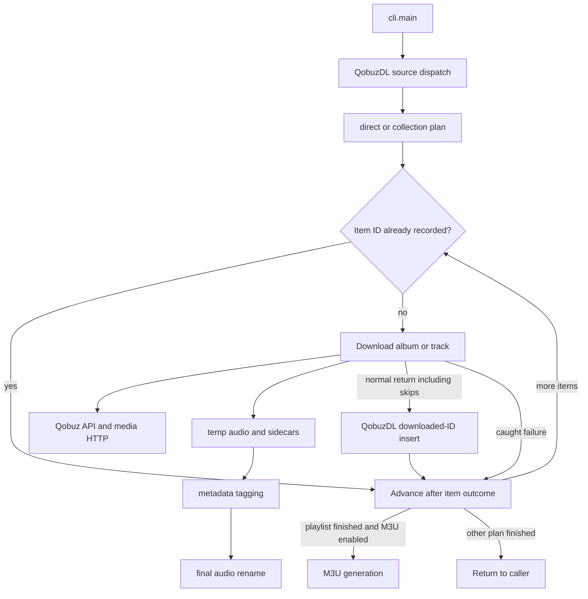

# qobuz-dl architecture

This page describes the current `qobuz-dl` runtime for maintainers and agents. The source baseline is `master` at `1ef6f5b2cdd741b5bb816bffdf2fad786c56dbff`, observed on 2026-09-12.

The CLI coordinates a sequential pipeline. It turns command arguments, saved configuration, URLs, and search results into Qobuz item IDs. It fetches metadata and media, writes library artifacts, and records downloaded IDs in SQLite. The runtime favors human terminal output and best-effort batch progress over a caller-readable execution result.

## The CLI owns process setup and cleanup

[`cli.main`](../qobuz_dl/cli.py) is the console entry point for both `qobuz-dl` and `qdl`. [`commands.qobuz_dl_args`](../qobuz_dl/commands.py) defines `dl`, `fun`, and `lucky`.

Startup classifies maintenance actions before authentication. Normal commands load `~/.config/qobuz-dl/config.ini` on Unix-like systems or the equivalent `%APPDATA%` path on Windows. The CLI merges saved defaults with command options, then constructs [`core.QobuzDL`](../qobuz_dl/core.py). Construction creates the download root and opens the downloaded-ID database before client authentication. The CLI then initializes the client and dispatches the command.

Config writes use a private temporary file, `fsync`, and `os.replace`. [`test_config_persistence.py`](../tests/test_config_persistence.py) covers private permissions and preservation of the previous file after interrupted writes.

Help and version normally exit before config setup. A bare invocation or `--show-config` can create missing config and prompt. Existing config handling can repair permissions. Boolean options combine CLI and config values with OR, so a saved true value cannot always be disabled for one invocation. Paths are computed at import time; missing `%APPDATA%` can prevent startup on Windows.

[`qopy.Client`](../qobuz_dl/qopy.py) owns endpoint parameters, signing, authentication, and 500-item collection pagination. Its constructor logs in and tests candidate secrets through `track/getFileUrl`. [`Bundle`](../qobuz_dl/bundle.py) extracts app credentials from the web login page and JavaScript bundle. Both use [`http.py`](../qobuz_dl/http.py), the production network boundary. HTTP defaults to a 30-second request timeout; Last.fm reads use 10 seconds. Neither is a whole-run deadline. [`test_qopy_characterization.py`](../tests/test_qopy_characterization.py) and [`test_bundle_downloader_characterization.py`](../tests/test_bundle_downloader_characterization.py) cover these boundaries with fakes.

After dispatch, `cli._handle_commands` calls `cli._remove_leftovers` in a `finally` block. The cleanup recursively removes hidden `.*.tmp` files below the download root. Direct Python consumers of `QobuzDL` do not receive this cleanup.

## Requests become direct or collection plans

[`core.QobuzDL`](../qobuz_dl/core.py) owns run options, source dispatch, search, collection expansion, duplicate checks, and downloader construction.

| Concept | Current role |
| --- | --- |
| `_DirectDownloadPlan` | One album or track ID plus its item kind |
| `_CollectionDownloadPlan` | Ordered IDs, a collection directory, an item kind, and M3U policy |
| `Download` | One album or track execution with naming, quality, artwork, and tagging options |
| Downloaded-ID database | A global per-user set of item IDs that suppresses later requests |

`QobuzDL.download_list_of_urls` processes sources in order. A source can be a Qobuz URL, a Last.fm playlist URL, or a local UTF-8 text file that contains more sources. `QobuzDL._resolve_url_download_plan` resolves albums and tracks directly. It materializes all pages of artist, label, and playlist metadata before the first collection item downloads.

Collection execution creates a sanitized directory and calls `QobuzDL.download_from_id` once per item. Qobuz and Last.fm playlists then call [`utils.make_m3u`](../qobuz_dl/utils.py), which scans readable FLAC and MP3 files in that directory and writes sorted relative entries.

## A download moves bytes through a temporary artifact

[`downloader.Download`](../qobuz_dl/downloader.py) owns the file lifecycle. Album execution fetches album metadata and checks streamability. It uses the first track response to resolve the album directory and quality fallback decision. Direct track execution resolves its own response and directory.

The current lifecycle is:

1. Check the downloaded-ID database before per-item metadata and file work
2. Resolve metadata and a Qobuz file URL at the requested format ID
3. Create the sanitized album or track directory
4. Download `cover.jpg` unless disabled, plus the first album booklet when present
5. Stream audio to `.<ordinal>.tmp` in the final album or disc directory
6. Write FLAC or MP3 tags into the temporary file
7. Rename the tagged temporary file to the sanitized final pathname
8. Insert the top-level item ID after the downloader returns normally

[`http.stream_download`](../qobuz_dl/http.py) streams media in 64 KiB chunks and checks `Content-Length` when supplied. `download_with_progress` removes the temporary file when streaming raises. The taggers in [`metadata.py`](../qobuz_dl/metadata.py) own the final rename.

Format IDs `5`, `6`, `7`, and `27` request MP3 320, CD-quality FLAC, hi-res up to 96 kHz, and hi-res above 96 kHz. Qobuz can return a downgrade restriction. `--no-fallback` rejects preparation when the response has that restriction.

For albums, only the first track controls the no-fallback decision. Later track responses do not repeat the check. The album directory uses the first resolved response's bit depth and sample rate. A custom track filename uses maximum quality fields from track metadata, so the directory and filename can describe different qualities after fallback.

## Filesystem and database writes are process effects

The runtime performs one request and one download at a time within a process. It has no thread pool, async scheduler, retry policy, total item limit, media byte budget, or free-space guard.

Separate processes have no shared artifact ownership protocol. Two processes can pass the same downloaded-ID check and write the same ordinal temporary path. The database query and insert use separate SQLite transactions. Recursive CLI cleanup can remove a matching temporary file owned by another process.

[`sanitize_filename`](../qobuz_dl/sanitize.py) removes control characters, cross-platform reserved characters, trailing dots, and reserved Windows names. It can return an empty string. The write path does not replace or reject an empty directory or track name. Final basenames are truncated to 250 characters, so two long names can collapse onto one pathname.

## Normal return does not prove completion

`Download.download_release` and `Download.download_track` do not return a result. They log `Completed` after reaching the end of the method. `QobuzDL.download_from_id` records history whenever the method returns normally.

Normal return also covers an `--albums-only` skip, a rejected quality, demo media, a missing media URL, an existing final pathname, and a caught tagging exception. The database can therefore contain an ID without a newly finalized artifact. Album history has one row and cannot describe partial track outcomes.

The history key contains only the item ID. It omits item kind, destination, requested quality, resolved quality, artifact paths, and time. A prior download to one destination suppresses the same ID in another destination. For playlists, this can omit a track from the playlist directory and generated M3U.

HTTP, connection, and non-streamable failures are logged and suppressed at the per-item boundary. Tagging exceptions are logged and suppressed inside the downloader. SQLite errors are logged and fail open. Process exit 0 can mean full success, partial work, skipped input, or a caught failure. Output is human-oriented and includes ANSI logging. There is no stable event or summary schema for agents.

The strongest proofs are [`test_download_execution_characterization.py`](../tests/test_download_execution_characterization.py), [`test_duplicate_tracking.py`](../tests/test_duplicate_tracking.py), [`test_metadata_characterization.py`](../tests/test_metadata_characterization.py), and [`test_http.py`](../tests/test_http.py). They cover successful layout and tags, stream cleanup, repeated IDs, and HTTP boundaries. They do not assert a structured result, partial album history, mixed-quality albums, or separate-process ownership.

## Change ownership and proof

| Change area | Primary owner | Minimum focused proof |
| --- | --- | --- |
| Startup, config, exit behavior | [`cli.py`](../qobuz_dl/cli.py), [`commands.py`](../qobuz_dl/commands.py) | [`test_commands.py`](../tests/test_commands.py), [`test_config_persistence.py`](../tests/test_config_persistence.py) |
| Source and collection routing | [`core.py`](../qobuz_dl/core.py) | [`test_core_regressions.py`](../tests/test_core_regressions.py), [`test_lastfm_characterization.py`](../tests/test_lastfm_characterization.py) |
| Quality, paths, and media lifecycle | [`downloader.py`](../qobuz_dl/downloader.py), [`http.py`](../qobuz_dl/http.py) | Download execution and HTTP tests |
| Tags and final rename | [`metadata.py`](../qobuz_dl/metadata.py) | [`test_metadata_characterization.py`](../tests/test_metadata_characterization.py) |
| History semantics | [`db.py`](../qobuz_dl/db.py), [`core.py`](../qobuz_dl/core.py) | [`test_db.py`](../tests/test_db.py), [`test_duplicate_tracking.py`](../tests/test_duplicate_tracking.py) |
| Filename behavior | [`sanitize.py`](../qobuz_dl/sanitize.py), [`downloader.py`](../qobuz_dl/downloader.py) | [`test_sanitization_characterization.py`](../tests/test_sanitization_characterization.py) |

Run `just ci` before finalizing code, tooling, packaging, or documentation changes. At this baseline the gate checks Ruff formatting and lint, pytest, CLI help, and package builds. Hosted CI also checks `--version` and runs Python 3.10 and 3.13. Neither gate runs the built wheel outside the source checkout here. Default tests use fakes and local fixtures. They must not require Qobuz credentials, a subscription, live network access, or real media downloads. See [`testing.md`](testing.md).

## Future contracts live outside this baseline

This page remains the source for current `master` behavior. Accepted decisions and open proposals for agent-readable results, artifact history, reuse, and playlist semantics belong in the [`agent ergonomics design`](feat/2026-09-12-agent-ergonomics/design-agent-ergonomics.md). Delivery order and proof gates belong in the [`agent ergonomics implementation plan`](feat/2026-09-12-agent-ergonomics/impl-plan-agent-ergonomics.md).

Until those changes land, the current limitations above remain authoritative.
